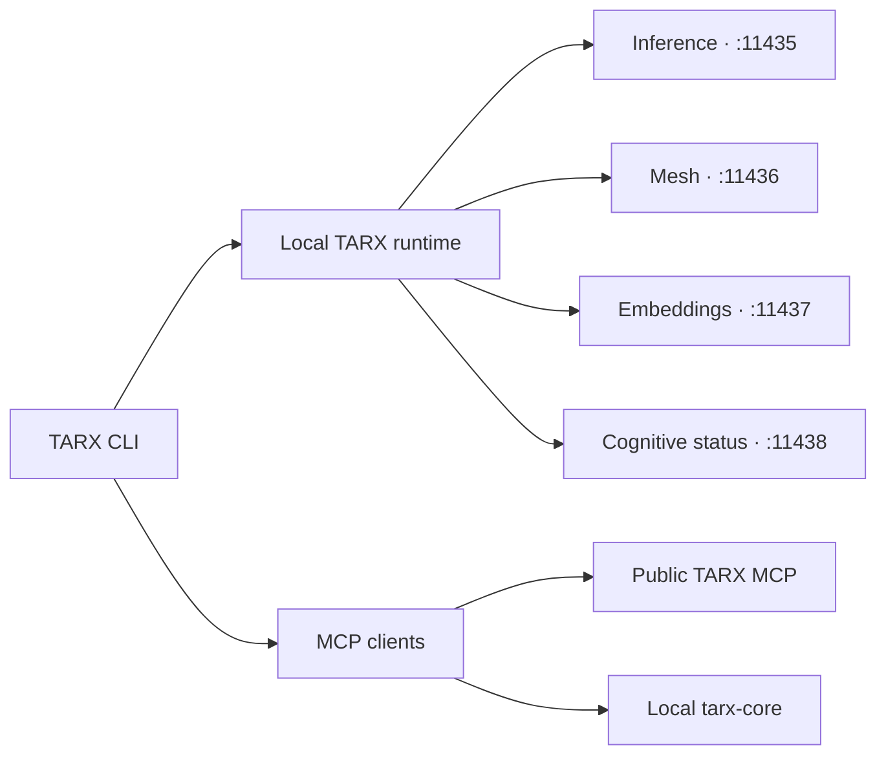

# TARX CLI

The local control plane for TARX: start private inference, inspect runtime health,
connect AI clients through MCP, and work with project-scoped memory from one
command.

TARX is building a governed personal AI runtime where memory, tools,
permissions, evidence, and execution work together. The CLI exposes a focused
public surface for operating that runtime without sending local model traffic to
a third-party inference service.

> **Status:** Public developer preview. Interfaces may change before the first
> stable release.

## What it demonstrates

- Local inference and embeddings through
  [llama.cpp](https://github.com/ggml-org/llama.cpp)
- Health checks and diagnostics across the TARX runtime
- MCP configuration for Claude Desktop, Claude Code, Cursor, and VS Code
- Project spaces, semantic search, and an opt-in mesh surface
- A portable POSIX shell client for macOS and Linux



## Quick start

The current CLI expects `llama-server`, Python 3 for safe MCP configuration
merges, and TARX model/runtime assets installed in the standard TARX data
directory.

```sh
brew install llama.cpp
install -m 755 tarx "$HOME/.local/bin/tarx"
tarx doctor
tarx start
tarx status
```

Connect a supported AI client:

```sh
tarx mcp add claude
tarx mcp add cc
tarx mcp add cursor
tarx mcp add vscode
tarx mcp status
```

Run `tarx help` for the complete command list.

## Route preflight

TARX can prove an inference route before a workflow depends on it:

```sh
tarx route check local
```

The local check sends one bounded, one-token request to the loopback inference
server. It distinguishes endpoint, authentication, model-access, availability,
and timeout failures without printing credentials or response bodies.

Remote inference remains fail-closed. Checking a remote route requires explicit
approval plus an HTTPS endpoint, model, and credential:

```sh
TARX_ALLOW_REMOTE_INFERENCE=1 \
TARX_REMOTE_INFERENCE_URL=https://inference.example.com/v1 \
TARX_REMOTE_INFERENCE_MODEL=approved-model \
TARX_REMOTE_INFERENCE_API_KEY=... \
tarx route check remote
```

For an intentional offline installation, `tarx route check remote --offline`
makes no network request and leaves remote inference disabled. The optional
`TARX_ROUTE_PREFLIGHT_TIMEOUT_SECONDS` setting defaults to 10 seconds.

## Runtime ports

| Port | Service |
| ---: | --- |
| 11435 | Local inference |
| 11436 | Mesh |
| 11437 | Embeddings |
| 11438 | Cognitive engine status |

Services bind to localhost by default. MCP configuration changes are backed up,
merged, validated, and written without replacing unrelated client settings.
The CLI uses each client's documented configuration envelope: `mcpServers` for
Claude and Cursor, and `servers` with explicit transport types for VS Code.
The tested [host adapter fixtures](tests/fixtures/mcp/README.md) document the
translation and merge invariants behind those client-specific writes.

### MCP host interop matrix

| Host | Envelope | Local stdio | Remote HTTP | Merge guarantee |
| --- | --- | --- | --- | --- |
| Claude Desktop | `mcpServers` | `command`, `args`, `env` | `url` | Preserve unknown third-party servers |
| Claude Code | `mcpServers` | `command`, `args`, `env` | `url` | Same as Desktop; fail-closed on invalid JSON |
| Cursor | `mcpServers` | `command`, `args`, `env` | `url` / host fields | Idempotent rewrite; backup before write |
| VS Code | `servers` | `type: "stdio"`, `command`, `args`, `env` | `type: "http"`, `url` | Never write Claude-shaped config into VS Code |

Fixtures live under `tests/fixtures/mcp/` and are exercised by
`tests/test-mcp-config.sh`. This matrix is also evidence for
[MCP issue #292](https://github.com/modelcontextprotocol/modelcontextprotocol/issues/292)
and [SEP-2633](https://github.com/modelcontextprotocol/modelcontextprotocol/pull/2633).

## Public boundary

This repository contains the public CLI and a health-canary schema. It does not
publish TARX's proprietary cognitive engine, orchestration control plane,
internal operations tools, model weights, or production infrastructure.

See [health/schema.json](health/schema.json) for the current public health
contract.

## Development

No build step is required.

```sh
sh -n tarx
shellcheck -S warning tarx
./tarx version
./tarx help
sh tests/test-mcp-config.sh
sh tests/test-route-preflight.sh
```

Please read [CONTRIBUTING.md](CONTRIBUTING.md) before opening a pull request.
Report security issues using [SECURITY.md](SECURITY.md), not a public issue.

## TARX

- [Download TARX Computer](https://tarx.com/download)
- [Documentation](https://tarx.com/docs)
- [TARX on GitHub](https://github.com/tarx-ai)
- [John Wantz Jr., founder and AI systems architect](https://github.com/wantzjt)
